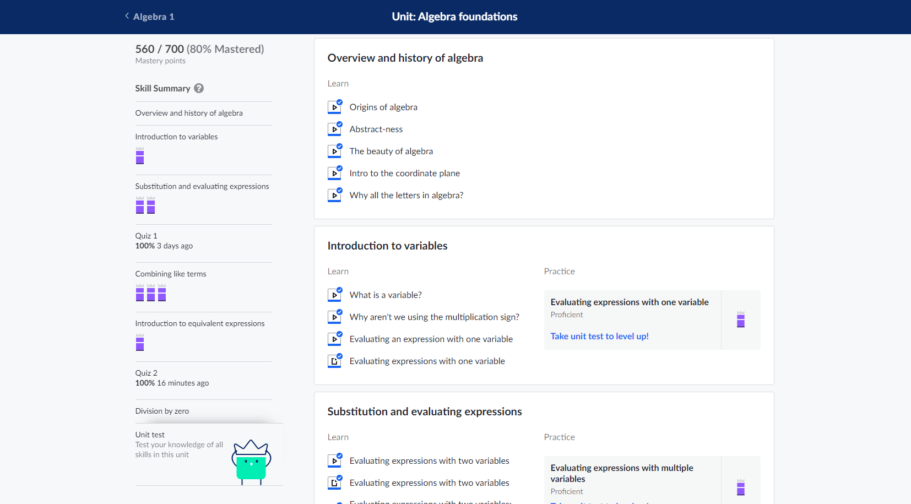

# Khan Academy Progress Tracker

A repo to track my progress in mathematics from Algebra to Calculus and beyond on Khan Academy

## Introduction

As part of my journey to become a web developer, I recognize the need to improve my understanding of higher-level mathematics. In pursuit of this goal, I am taking a systematic approach by completing the high school and post-secondary mathematics curriculum on Khan Academy.

## Project Status

This project is ongoing and will only be completed upon completion of the Khan Academy curriculum.

I am currently working on [Algebra Unit 1: Solving Equations and Inequalities](https://www.khanacademy.org/math/algebra).

My current progress: 

